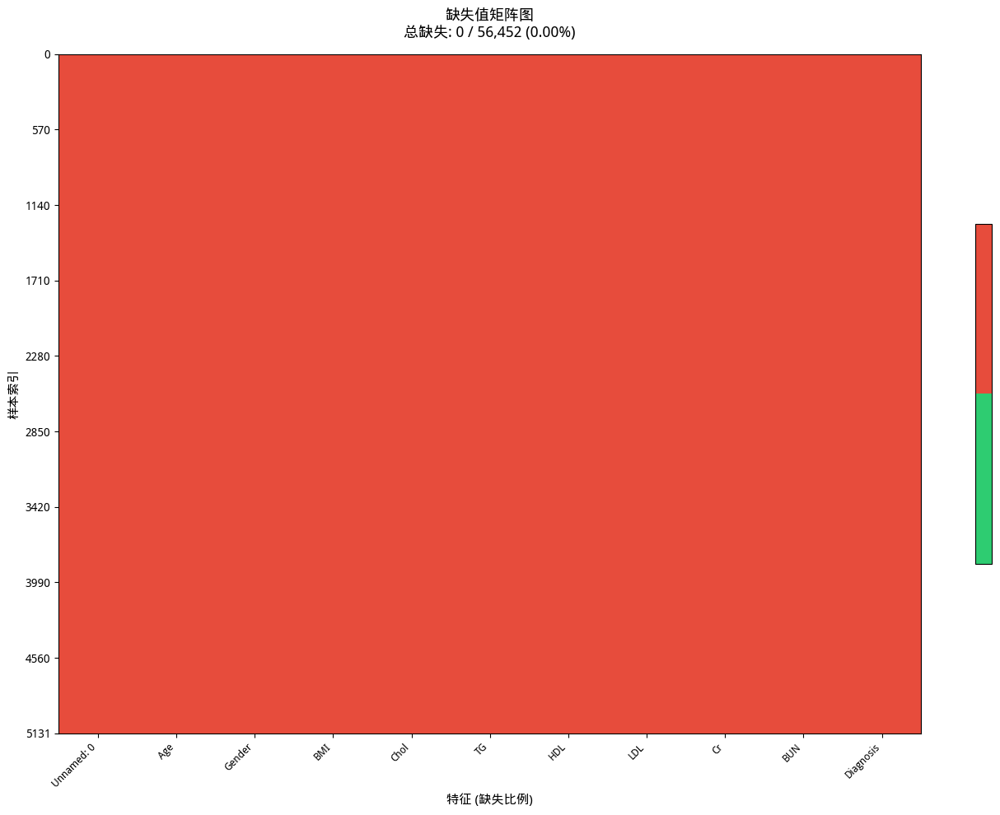
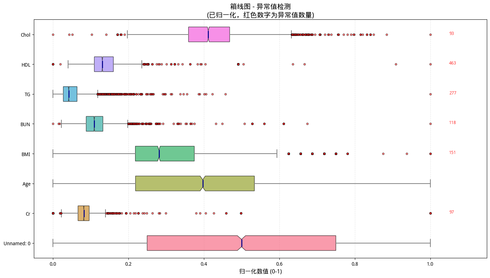
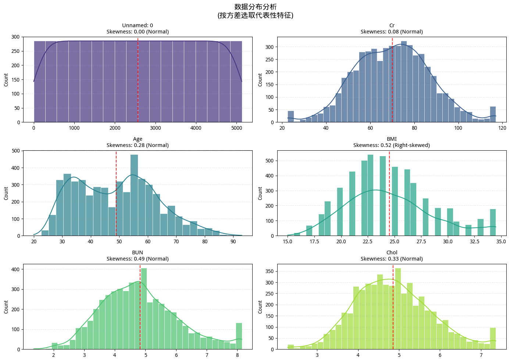
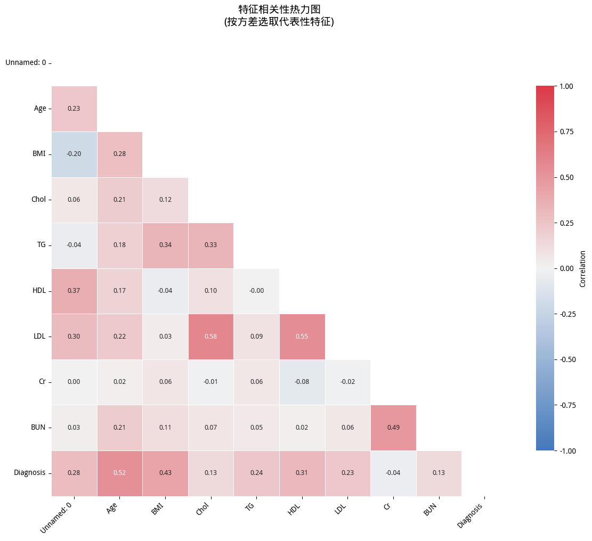

# 📊 数据分析报告

## 1. 数据概览
- **总行数**: 5,132
- **总列数**: 11
- **数值列**: 10 列
- **分类列**: 1 列
- **内存占用**: 0.64 MB

## 2. 缺失值分析
- **总缺失单元格**: 0
- **整体缺失率**: 0.0%
- **含缺失值的列数**: 0

## 3. 异常值分析
- **含异常值的列数**: 0

## 4. 数据分布

| 列名 | 均值 | 标准差 | 偏度 | 分布类型 |
|------|------|--------|------|----------|
| Unnamed: 0 | 2565.5 | 1481.625 | 0.0 | 近似正态 |
| Age | 48.95 | 14.049 | 0.277 | 近似正态 |
| BMI | 24.539 | 4.063 | 0.518 | 近似正态 |
| Chol | 4.856 | 0.951 | 0.33 | 近似正态 |
| TG | 1.629 | 0.938 | 0.937 | 近似正态 |
| HDL | 1.383 | 0.423 | 0.819 | 近似正态 |
| LDL | 2.909 | 0.927 | 0.526 | 近似正态 |
| Cr | 70.128 | 17.124 | 0.077 | 近似正态 |
| BUN | 4.826 | 1.28 | 0.492 | 近似正态 |
| Diagnosis | 0.388 | 0.487 | 0.458 | 近似正态 |

## 5. 相关性分析
- **最高相关系数**: 0.593

| 特征1 | 特征2 | 相关系数 |
|-------|-------|----------|
| Chol | LDL | 0.593 |
| Age | Diagnosis | 0.525 |
| BMI | Diagnosis | 0.428 |
| BMI | TG | 0.421 |
| HDL | LDL | 0.42 |
| Cr | BUN | 0.36 |
| Chol | TG | 0.345 |
| Unnamed: 0 | HDL | 0.314 |
| Unnamed: 0 | LDL | 0.307 |
| TG | Diagnosis | 0.298 |

## 6. 处理建议
- ✅ 数据质量良好，可直接用于建模

## 7. 处理日志
- 检测到ID列: ['Unnamed: 0']（已排除分析）
- 列 'Age' 使用盖帽法处理异常值
- 列 'BMI' 使用盖帽法处理异常值
- 列 'Chol' 使用盖帽法处理异常值
- 列 'TG' 使用盖帽法处理异常值
- 列 'HDL' 使用盖帽法处理异常值
- 列 'LDL' 使用盖帽法处理异常值
- 列 'Cr' 使用盖帽法处理异常值
- 列 'BUN' 使用盖帽法处理异常值
- 列 'Diagnosis' 使用盖帽法处理异常值

## 📈 分析图表

### 缺失值分析

### 异常值分析

### 数据分布

### 相关性分析

