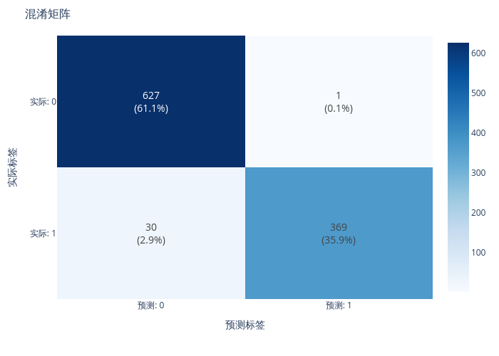
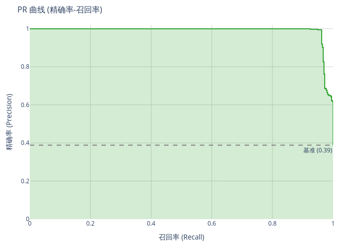

# 智能医疗系统 - 模型评估报告

---

## 📋 报告信息

- **生成时间**: 2025-12-07 17:42:20
- **报告类型**: 模型评估
- **模型类型**: Random Forest
- **数据来源**: 训练测试集

---

## 📊 评估数据集

- **样本数量**: 1027
- **特征数量**: 11

### 类别分布

| 类别 | 样本数 | 占比 |
|------|--------|------|
| 0 | 628 | 61.15% |
| 1 | 399 | 38.85% |

---

## 📈 整体性能指标

| 指标 | 值 | 说明 |
|------|-----|------|
| **准确率 (Accuracy)** | 0.9698 | 正确预测的样本比例 |
| **精确率 (Precision)** | 0.9758 | 预测为正的样本中真正为正的比例 |
| **召回率 (Recall)** | 0.9616 | 真实为正的样本中被正确预测的比例 |
| **F1分数 (F1-Score)** | 0.9678 | 精确率和召回率的调和平均 |
| **AUC** | 0.9897 | ROC曲线下的面积 |

---

## 📊 各类别详细指标

| 类别 | 精确率 | 召回率 | F1分数 | 样本数 |
|------|--------|--------|--------|--------|
| 0 | 0.9543 | 0.9984 | 0.9759 | 628 |
| 1 | 0.9973 | 0.9248 | 0.9597 | 399 |
|------|--------|--------|--------|--------|
| **宏平均** | 0.9758 | 0.9616 | 0.9678 | - |
| **加权平均** | 0.9710 | 0.9698 | 0.9696 | - |

---

## 📉 可视化分析

### 混淆矩阵

混淆矩阵展示了模型预测结果与真实标签的对比情况：

### ROC曲线

ROC曲线展示了不同阈值下真正例率与假正例率的关系：

### PR曲线

PR曲线展示了不同阈值下精确率与召回率的关系：

---

## 💡 性能解读

### 准确率评价

✅ **优秀** (≥90%) - 模型准确率表现优异

### F1分数评价

✅ **优秀** (≥85%) - 模型综合性能优异

---

## 🎯 优化建议

### 后续工作建议

1. **泛化验证**: 在更多真实数据上验证模型泛化能力
2. **错误分析**: 分析预测错误的样本，找出改进方向
3. **模型部署**: 性能满意后可以部署到生产环境
4. **持续监控**: 定期评估模型性能，及时更新维护

---

*报告生成于 2025-12-07 17:42:20*
