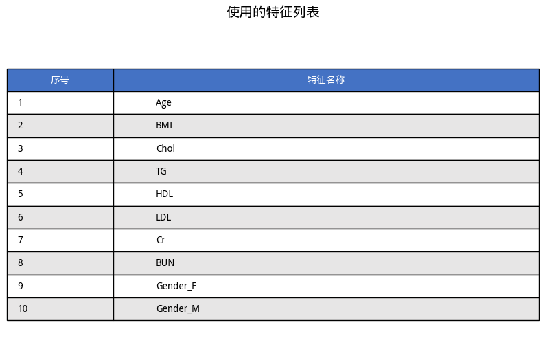

# 智能医疗系统 - 模型训练报告

---

## 📋 报告信息

- **生成时间**: 2025-12-07 17:41:33
- **报告类型**: 模型训练
- **模型类型**: Random Forest
- **数据切分方法**: 简单切分

---

## 📊 数据集信息

### 基本统计

- **总样本数**: 5132
- **特征数量**: 10
- **标签列**: `Diagnosis`

### 使用的特征

共 **10** 个特征：

| `Age` | `BMI` | `Chol` |
| --- | --- | --- |
| `TG` | `HDL` | `LDL` |
| `Cr` | `BUN` | `Gender_F` |
| `Gender_M` |

### 类别分布

| 类别 | 样本数 | 占比 |
|------|--------|------|
| 0 | 3139 | 61.17% |
| 1 | 1993 | 38.83% |

---

## ⚙️ 训练配置

### 数据切分参数

- **随机种子**: 42
- **训练集比例**: 80% (4105 样本)
- **测试集比例**: 20% (1027 样本)

### Random Forest 模型参数

| 参数 | 值 | 说明 |
|------|-----|------|
| `n_estimators` | 100 | 树的数量 |
| `max_depth` | 2 | 树的最大深度 |
| `max_features` | sqrt | 每次分裂考虑的最大特征数 |

---

## 📈 训练结果

### 模型训练完成

✅ 模型已使用训练集（4105 样本）训练完成

📊 测试集（1027 样本）已保留用于后续评估

---

## 📝 后续步骤

1. ✅ 模型训练已完成
2. 🔜 请查看**评估报告**了解模型在测试集上的详细性能
3. 🔜 如需优化，可以调整模型参数后重新训练
4. 🔜 性能满意后，可以使用模型进行预测

---

*报告生成于 2025-12-07 17:41:33*
